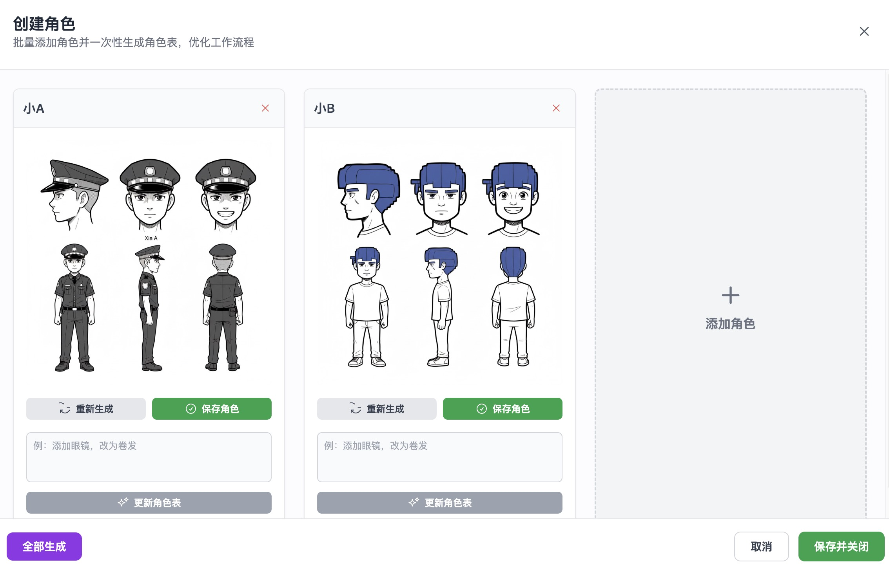
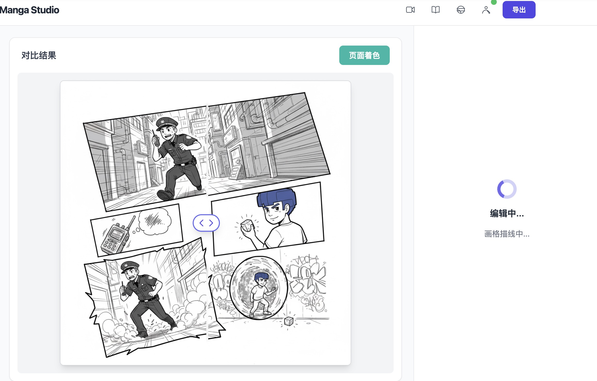
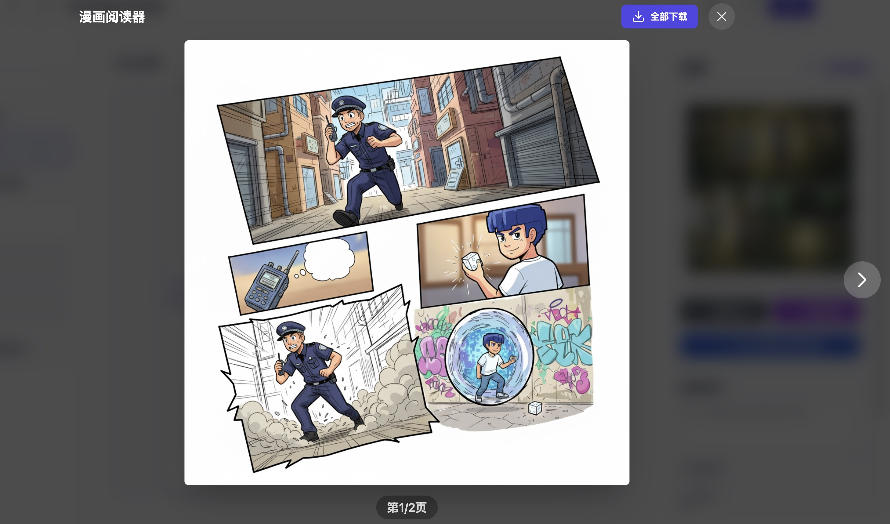

# AIMangaStudio

[](./README.md) [](./README.en-US.md) [](./README.ja-JP.md)


一个利用 AI 制作漫画的工具，支持脚本创作、分镜设计和角色风格控制。

## 项目概述
AIMangaStudio 旨在为独立创作者与工作室提供一套端到端的漫画创作流水线，集成剧情生成、分镜布局、角色设定与页间连续性分析等功能，简化从脚本到漫画页面的制作流程。

## 主要功能
1. 自然语言生成漫画脚本（剧情、对白、旁白）

    

2. 角色与风格设定（支持多种绘画风格）
    

3. AI 分镜自动排版（对话框、镜头切换）
    

4. 多页漫画导出（PNG、PDF）

    

## 快速开始
### 环境要求
- Node.js（建议 18+）
- npm 或 yarn

### 安装
```bash
npm install
# 或
# yarn
```

### 开发
```bash
npm run dev
```

### 构建与预览
```bash
npm run build
npm run preview
```

## 技术栈
- 前端：React + Vite + TypeScript
- AI：Google GenAI（通过 `@google/genai` 包）


## 一键部署
[](https://vercel.com/new/clone?repository-url=https://github.com/morsoli/aimangastudio)

[](https://app.netlify.com/start/deploy?repository=https://github.com/morsoli/aimangastudio)


## 目标用户
- 独立创作者
- 漫画爱好者
- 内容工作室
- 自媒体运营者

## 贡献
欢迎提交 issue 或 pull request。请遵循项目的代码风格与贡献指南。

## 许可证
MIT
